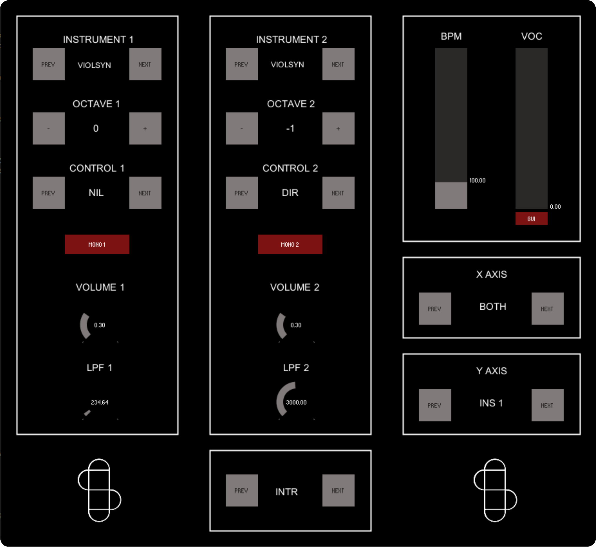

# ANSAL CMLS PROJECT
## Summary of the functionalities
The aim of our project is to provide small groups of musicians with a comprehensive tool to expand their musical possibilities and perform as if they were a full band. To achieve this, we have implemented the following modules:
1. **Polyphonic MIDI Phase Vocoder (JUCE)**: This allows for the simulation of vocal harmonies, enriching the musical landscape.
2. **Polyphonic Synthesizer**: Features numerous functionalities including mono mode, keyboard split, low-pass filter (LPF), octave shift, pitch shift, and drum sequences, which will be detailed later.
   Note: These two instruments are interconnected. The Vocoder is accessible via the Synth interface, and the notes received by the Synth are forwarded to the Vocoder. This setup enables a single person to play both instruments effortlessly.
3. **Guitar Effects Suite**: Enhances the guitar sound and uses pitch recognition to identify the fundamental note of the chord being played. This allows the simulation of doubling on that note, enabling a single guitarist to "play two guitars or a guitar and a bass."

The functionalities of the modules can be modified either through the graphical interface or via MIDI command mappings, as will be illustrated later.

# Vocoder Module


The polyphonic vocoder implemented in this project is a K-voice polyphonic vocoder (where K is a parameter that can be easily modified in the private variables in PluginProcessor) controlled via MIDI. The operation is as follows:

1. **Audio Input**: The audio enters through the microphone input into the PluginProcessor. Here, it is normalized (using the SimpleCompressor class) to ensure a stable input signal level.
2. **Audio and MIDI Processing**: The processBlock reads the incoming audio buffer and MIDI input. For each MIDI note read, it activates one of the K voices and assigns it to process the audio buffer at the specific MIDI note frequency.
3. **Voice Processing**: Each vocoder voice (PhaseVoc class) processes the audio buffer using the following formula:
   ...
4. **Envelope Application**: To ensure the notes have a pleasant envelope, PhaseVoc applies methods from the EnvelopeGenerator class to the processed audio. Once this is done, it returns the buffer containing the processed result to PluginProcessor.
5. **High-Pass Filtering**: Before outputting the audio, PluginProcessor applies a High-Pass Filter (HighPassFilter class) to the outgoing audio to remove the lowest frequencies and enhance audio intelligibility if necessary.

The following steps and the class hierarchy related to audio processing are easily deducible from the following diagram:


# Synh Module

## Synth Hardware Configuration
The hardware setup for the synth module is as follows:
### MIDI Input Devices
You can modify and control the system parameters using various MIDI controllers (details on how this is achieved will be provided in subsequent sections). The devices include:
* MIDI keyboard (Arturia Minilab configured with [this preset](ReadmeFiles/MIDIMapConfig.minilabmk2)).
* Sustain pedal.
* Volume control pedal (not used for volume control).
* Analog control pedal to MIDI signal adapter (I used [this one](https://beatbars.com/en/dual-to-midi.html)).
### Hand Inclination Input
The system also takes input from the hand inclination of the keyboardist. The reason and method for using this to aid in system control will be explained later. The necessary hardware devices are:
* Accelerometer: Mounted on a glove to be worn while playing (I used [this one](https://wiki.dfrobot.com/Triple_Axis_Accelerometer_MMA7361_SKU_DFR0143)).
* Arduino Uno: Required to derive angle data from the accelerometer coordinates and interface the accelerometer with the system.

The system components are connected as illustrated in the figure below:


## Midi Mapping


## Supercollider Code Desription
### Files and Descriptions
1. **ArduinoAdapter.scd**
   - **Purpose:** Interfaces with Arduino to receive accelerometer data from a glove, enabling gesture-based control of synthesizer parameters.
   - **Features:**
     - Initializes serial communication with the Arduino.
     - Maps accelerometer data to control various synth parameters.
     - Real-time data handling for expressive performance control.
   - **Code Highlights:**
     ```supercollider
     SerialPort.listDevices;
     ~arduino = SerialPort("/dev/tty.usbmodem1411", 9600);
     ~arduino.read;
     ```

2. **Drum_Midi.scd**
   - **Purpose:** Manages MIDI input and output specifically for drum sounds.
   - **Features:**
     - Receives MIDI notes and maps them to drum sounds.
     - Supports MIDI synchronization for tight integration with external sequencers and drum machines.
     - Provides customizable drum kit setups.
   - **Code Highlights:**
     ```supercollider
     MIDIIn.connectAll;
     ~midiClient = MIDIClient.init;
     ```

3. **Drum_Sequences.scd**
   - **Purpose:** Manages drum sequences and patterns.
   - **Features:**
     - Defines and controls drum patterns.
     - Syncs with MIDI clock for tight timing.
   - **Code Highlights:**
     ```supercollider
     Pbind(\instrument, \drum, \dur, Pseq([0.5, 0.5, 1.0], inf)).play;
     ```

4. **Drum_SynthDef.scd**
   - **Purpose:** Defines the drum synthesizer's sound generation.
   - **Features:**
     - Creates various drum sounds using SynthDefs.
     - Customizable sound parameters.
   - **Code Highlights:**
     ```supercollider
     SynthDef(\kick, { |freq = 60|
         // Kick drum synthesis code
      }).add;
      ```

5. **Inst_Midi.scd**
   - **Purpose:** Handles MIDI communication for various musical instruments.
   - **Features:**
     - Receives MIDI input from a keyboard or other controllers.
     - Maps MIDI notes to synth parameters and audio outputs.
     - Supports MIDI control change (CC) messages for dynamic performance adjustments.
   - **Code Highlights:**
     ```supercollider
     MIDIdef.noteOn(\noteOn, { |vel, num, chan, src|
         // Synth code here
     });
     ```

6. **Inst_SynthDef.scd**
   - **Purpose:** Defines the instrument synthesizer's sound generation.
   - **Features:**
     - Creates a variety of instrument sounds using SynthDefs.
     - Customizable sound parameters.
   - **Code Highlights:**
     ```supercollider
     SynthDef(\lead, { |freq = 440|
         // Lead synth sound code
      }).add;
      ```

7. **Knobs.scd**
   - **Purpose:** Implements both virtual and hardware knob controls.
   - **Features:**
     - Maps hardware knobs (e.g., MIDI controllers) to synth parameters.
     - Provides virtual knobs for real-time parameter adjustments within the SuperCollider environment.
     - Supports smooth, responsive control for performance tweaking.
   - **Code Highlights:**
     ```supercollider
     GUI.knob.new; // Example of virtual knob
     ```

8. **Main.scd**
   - **Purpose:** The central script that initializes the synthesizer environment.
   - **Features:**
     - Loads and configures all necessary components.
     - Sets up initial synth parameters and connections.
     - Manages the overall workflow and interaction between different scripts.
   - **Code Highlights:**
     ```supercollider
     s.boot;
     ```

9. **Midi_Init.scd**
   - **Purpose:** Initializes MIDI settings and configurations.
   - **Features:**
     - Sets up MIDI client and connections.
     - Configures MIDI input and output.
   - **Code Highlights:**
     ```supercollider
     MIDIClient.init;
     ```

10. **OSCCommunication.scd**
    - **Purpose:** Provides Open Sound Control (OSC) communication capabilities.
    - **Features:**
      - Sets up OSC communication between SuperCollider and other OSC-compatible software/hardware.
      - Enables remote control and networked performances.
      - Handles incoming and outgoing OSC messages efficiently.
    - **Code Highlights:**
      ```supercollider
      NetAddr.localAddr;
      OSCdef(\recv, { |msg, time, addr, port|
          // Handle OSC message
      });
      ```

11. **PresetsManaging.scd**
    - **Purpose:** Enables the saving and loading of presets.
    - **Features:**
      - Saves current synth settings to a preset file.
      - Loads preset configurations on demand.
      - Facilitates quick switching between different sound setups.
    - **Code Highlights:**
      ```supercollider
      // Save preset
      presets.save("presetName");
      // Load preset
      presets.load("presetName");
      ```

12. **VST3adapter.scd**
    - **Purpose:** Integrates VST3 plugins, specifically a vocoder that harmonizes with the notes played on the synthesizer.
    - **Features:**
      - Loads and configures VST3 plugins within SuperCollider.
      - Maps synth notes to the vocoder for harmonic processing.
      - Enhances sonic possibilities with advanced audio effects.
    - **Code Highlights:**
      ```supercollider
      VSTPlugin.search(s);
      ~vocoder = VSTPluginController.new(s, "path/to/vocoder.vst3");
      ```

# Guitar Module

