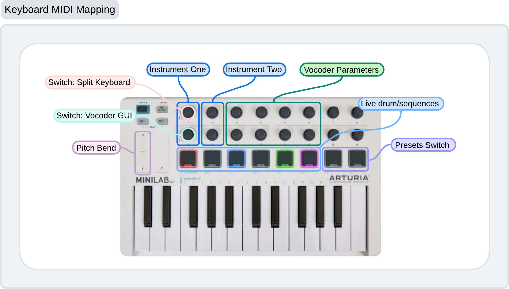

# ANSAL CMLS PROJECT
## Summary of the Vocoder and Synth functionalities


## Supercollider Section


### Files and Descriptions
1. **ArduinoAdapter.scd**
   - **Purpose:** Interfaces with Arduino to receive accelerometer data from a glove, enabling gesture-based control of synthesizer parameters.
   - **Features:**
     - Initializes serial communication with the Arduino.
     - Maps accelerometer data to control various synth parameters.
     - Real-time data handling for expressive performance control.
   - **Code Highlights:**
     ```supercollider
     SerialPort.listDevices;
     ~arduino = SerialPort("/dev/tty.usbmodem1411", 9600);
     ~arduino.read;
     ```

2. **Drum_Midi.scd**
   - **Purpose:** Manages MIDI input and output specifically for drum sounds.
   - **Features:**
     - Receives MIDI notes and maps them to drum sounds.
     - Supports MIDI synchronization for tight integration with external sequencers and drum machines.
     - Provides customizable drum kit setups.
   - **Code Highlights:**
     ```supercollider
     MIDIIn.connectAll;
     ~midiClient = MIDIClient.init;
     ```

3. **Drum_Sequences.scd**
   - **Purpose:** Manages drum sequences and patterns.
   - **Features:**
     - Defines and controls drum patterns.
     - Syncs with MIDI clock for tight timing.
   - **Code Highlights:**
     ```supercollider
     Pbind(\instrument, \drum, \dur, Pseq([0.5, 0.5, 1.0], inf)).play;
     ```

4. **Drum_SynthDef.scd**
   - **Purpose:** Defines the drum synthesizer's sound generation.
   - **Features:**
     - Creates various drum sounds using SynthDefs.
     - Customizable sound parameters.
   - **Code Highlights:**
     ```supercollider
     SynthDef(\kick, { |freq = 60|
         // Kick drum synthesis code
      }).add;
      ```

5. **Inst_Midi.scd**
   - **Purpose:** Handles MIDI communication for various musical instruments.
   - **Features:**
     - Receives MIDI input from a keyboard or other controllers.
     - Maps MIDI notes to synth parameters and audio outputs.
     - Supports MIDI control change (CC) messages for dynamic performance adjustments.
   - **Code Highlights:**
     ```supercollider
     MIDIdef.noteOn(\noteOn, { |vel, num, chan, src|
         // Synth code here
     });
     ```

6. **Inst_SynthDef.scd**
   - **Purpose:** Defines the instrument synthesizer's sound generation.
   - **Features:**
     - Creates a variety of instrument sounds using SynthDefs.
     - Customizable sound parameters.
   - **Code Highlights:**
     ```supercollider
     SynthDef(\lead, { |freq = 440|
         // Lead synth sound code
      }).add;
      ```

7. **Knobs.scd**
   - **Purpose:** Implements both virtual and hardware knob controls.
   - **Features:**
     - Maps hardware knobs (e.g., MIDI controllers) to synth parameters.
     - Provides virtual knobs for real-time parameter adjustments within the SuperCollider environment.
     - Supports smooth, responsive control for performance tweaking.
   - **Code Highlights:**
     ```supercollider
     GUI.knob.new; // Example of virtual knob
     ```

8. **Main.scd**
   - **Purpose:** The central script that initializes the synthesizer environment.
   - **Features:**
     - Loads and configures all necessary components.
     - Sets up initial synth parameters and connections.
     - Manages the overall workflow and interaction between different scripts.
   - **Code Highlights:**
     ```supercollider
     s.boot;
     ```

9. **Midi_Init.scd**
   - **Purpose:** Initializes MIDI settings and configurations.
   - **Features:**
     - Sets up MIDI client and connections.
     - Configures MIDI input and output.
   - **Code Highlights:**
     ```supercollider
     MIDIClient.init;
     ```

10. **OSCCommunication.scd**
    - **Purpose:** Provides Open Sound Control (OSC) communication capabilities.
    - **Features:**
      - Sets up OSC communication between SuperCollider and other OSC-compatible software/hardware.
      - Enables remote control and networked performances.
      - Handles incoming and outgoing OSC messages efficiently.
    - **Code Highlights:**
      ```supercollider
      NetAddr.localAddr;
      OSCdef(\recv, { |msg, time, addr, port|
          // Handle OSC message
      });
      ```

11. **PresetsManaging.scd**
    - **Purpose:** Enables the saving and loading of presets.
    - **Features:**
      - Saves current synth settings to a preset file.
      - Loads preset configurations on demand.
      - Facilitates quick switching between different sound setups.
    - **Code Highlights:**
      ```supercollider
      // Save preset
      presets.save("presetName");
      // Load preset
      presets.load("presetName");
      ```

12. **VST3adapter.scd**
    - **Purpose:** Integrates VST3 plugins, specifically a vocoder that harmonizes with the notes played on the synthesizer.
    - **Features:**
      - Loads and configures VST3 plugins within SuperCollider.
      - Maps synth notes to the vocoder for harmonic processing.
      - Enhances sonic possibilities with advanced audio effects.
    - **Code Highlights:**
      ```supercollider
      VSTPlugin.search(s);
      ~vocoder = VSTPluginController.new(s, "path/to/vocoder.vst3");
      ```
