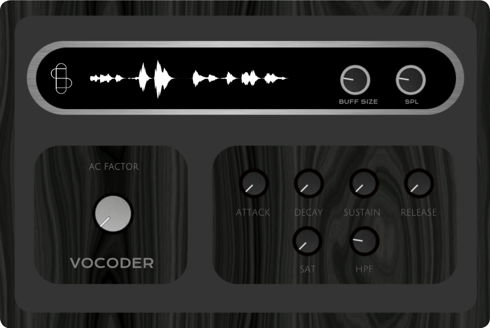
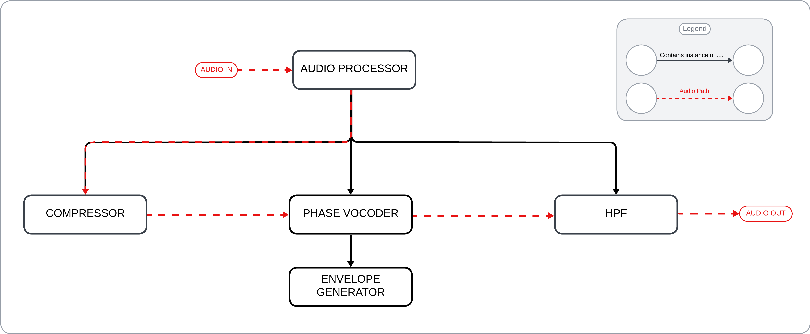
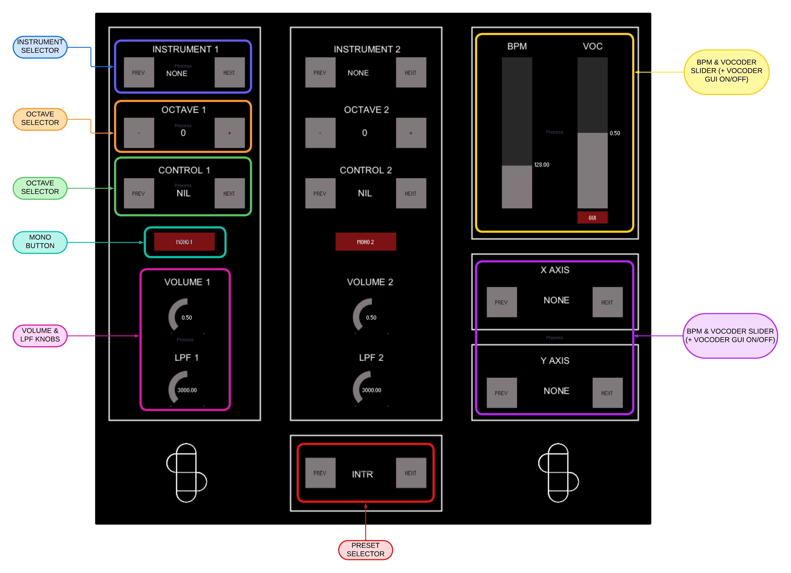
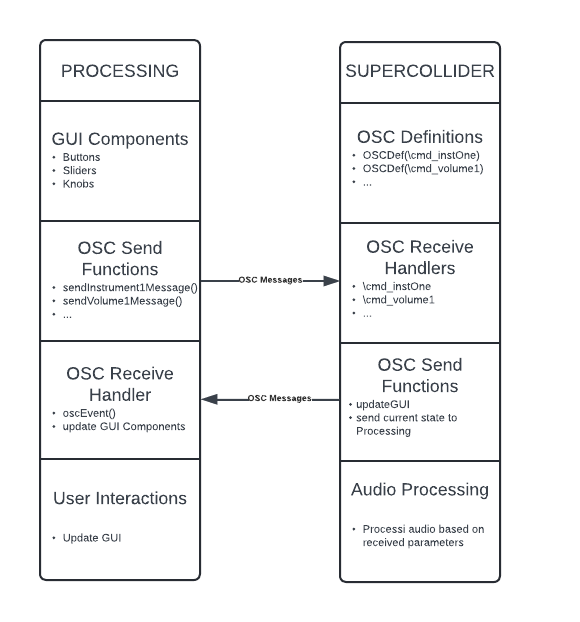
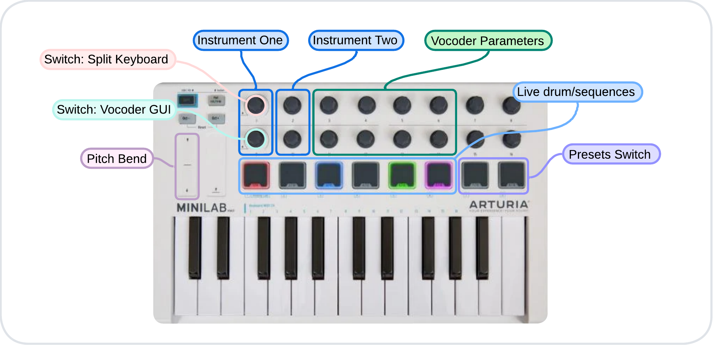
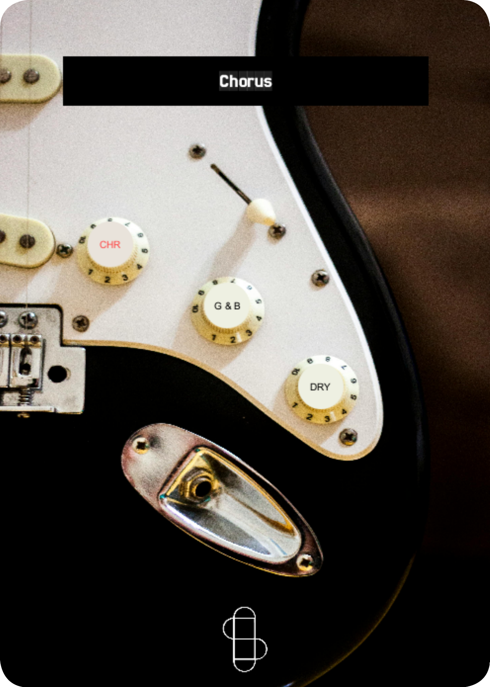

# ANSAL CMLS PROJECT
## Summary of the functionalities
The aim of our project is to provide small groups of musicians with a comprehensive tool to expand their musical possibilities and perform as if they were a full band. To achieve this, we have implemented the following modules:
1. **Polyphonic MIDI Phase Vocoder (JUCE)**: This allows for the simulation of vocal harmonies, enriching the musical landscape.
2. **Polyphonic Synthesizer**: Features numerous functionalities including mono mode, keyboard split, low-pass filter (LPF), octave shift, pitch shift, and drum sequences, which will be detailed later.
   Note: These two instruments are interconnected. The Vocoder is accessible via the Synth interface, and the notes received by the Synth are forwarded to the Vocoder. This setup enables a single person to play both instruments effortlessly.
3. **Guitar Effects Suite**: Uses pitch recognition to identify the fundamental notes of the chords being played. This allows to process that note, with or without syntetic sounds and or harmonizations, enabling a single guitarist to "play two guitars" or a "guitar and a bass."

The functionalities of the modules can be modified either through the graphical interface or via MIDI command mappings, as will be illustrated later.

# Vocoder Module

The polyphonic vocoder implemented in this project is a K-voice polyphonic vocoder (where K is a parameter that can be easily modified in the private variables in PluginProcessor) controlled via MIDI. The operation is as follows:

1. **Audio Input**: The audio enters through the microphone input into the PluginProcessor. Here, it is normalized (using the SimpleCompressor class) to ensure a stable input signal level.
2. **Audio and MIDI Processing**: The processBlock reads the incoming audio buffer and MIDI input. For each MIDI note read, it activates one of the K voices and assigns it to process the audio buffer at the specific MIDI note frequency.
3. **Voice Processing**: Each vocoder voice (PhaseVoc class) processes the audio buffer using the following "leaky autocorrelation" formula:

$$ R_{l,n} = (1 - k) R_{l,n-1} + k x_n x_{n-l} $$

   Where: 
   - **$R_{l,n}$**: Leaky autocorrelation at lag $l$ and time $n$.
   - **$R_{l,n-1}$**: Leaky autocorrelation at lag $l$ and previous time step $n-1$.
   - **$x_n$**: Input signal at time $n$.
   - **$x_{n-l}$**: Input signal $l$ steps before $n$.
   - **$k$**: Leakiness constant, typically around $0.001$.

  This formula balances past autocorrelation values with new data, allowing the vocoder to adapt to changes in the speech signal over time.

4. **Envelope Application**: To ensure the notes have a pleasant envelope, PhaseVoc applies methods from the EnvelopeGenerator class to the processed audio. Once this is done, it returns the buffer containing the processed result to PluginProcessor.
5. **High-Pass Filtering**: Before outputting the audio, PluginProcessor applies a High-Pass Filter (HighPassFilter class) to the outgoing audio to remove the lowest frequencies and enhance audio intelligibility if necessary.

The following steps and the class hierarchy related to audio processing are easily deducible from the following diagram:

# Synth Module

The synth module includes numerous functions available to the user, all controllable via both the graphical interface and MIDI. Additionally, the Vocoder described in the previous section is integrated within the Synth module. This setup ensures that the MIDI notes used to play the synthesizer are also forwarded to the Vocoder, allowing it to modulate the voice with the same harmonies.

# Synth Module GUI
The Processing code creates a graphical user interface (GUI) that allows users to control various musical parameters. These parameters are sent to SuperCollider using the Open Sound Control (OSC) protocol. SuperCollider processes these parameters to produce the corresponding audio output and can send updates back to Processing to dynamically adjust the GUI.

## Processing
The Processing code is responsible for creating the GUI, which includes buttons, sliders, and knobs for controlling various musical parameters such as volume, low-pass filters (LPF), instrument selection, octaves, control pedals, and presets. When a user interacts with the GUI components, OSC messages are sent to SuperCollider to update the corresponding musical parameters.

### OSC Communication
The oscEvent(OscMessage theOscMessage) function handles the reception of OSC messages from SuperCollider. When an OSC message is received, the GUI components are updated accordingly.

## SuperCollider
The SuperCollider code manages the reception and processing of OSC messages sent from the Processing GUI. It also sends OSC messages back to Processing to update the GUI based on the current state of the audio parameters.

The ~updateGUI function sends OSC messages to Processing to update the GUI with the current values of audio parameters. This function is periodically executed by the ~guiRoutine to ensure the GUI remains synchronized with the audio processing state.

### Routine
The ~guiRoutine is a loop that calls ~updateGUI every 0.1 seconds to send updates to the Processing GUI. This ensures that all parameter changes in SuperCollider are reflected in the GUI.

## Synth Hardware Configuration
The hardware setup for the synth module is as follows:
### MIDI Input Devices
You can modify and control the system parameters using various MIDI controllers (details on how this is achieved will be provided in subsequent sections). The devices include:
* MIDI keyboard (Arturia Minilab configured with [this preset](ReadmeFiles/MIDIMapConfig.minilabmk2)).
* Sustain pedal.
* Volume control pedal (not used for volume control).
* Analog control pedal to MIDI signal adapter (I used [this one](https://beatbars.com/en/dual-to-midi.html)).
### Hand Inclination Input
The system also takes input from the hand inclination of the keyboardist. The reason and method for using this to aid in system control will be explained later. The necessary hardware devices are:
* Accelerometer: Mounted on a glove to be worn while playing (I used [this one](https://wiki.dfrobot.com/Triple_Axis_Accelerometer_MMA7361_SKU_DFR0143)).
* Arduino Uno: Required to derive angle data from the accelerometer coordinates and interface the accelerometer with the system.

The system components are connected as illustrated in the figure below:

## Synth Functionalities

# Guitar Module

